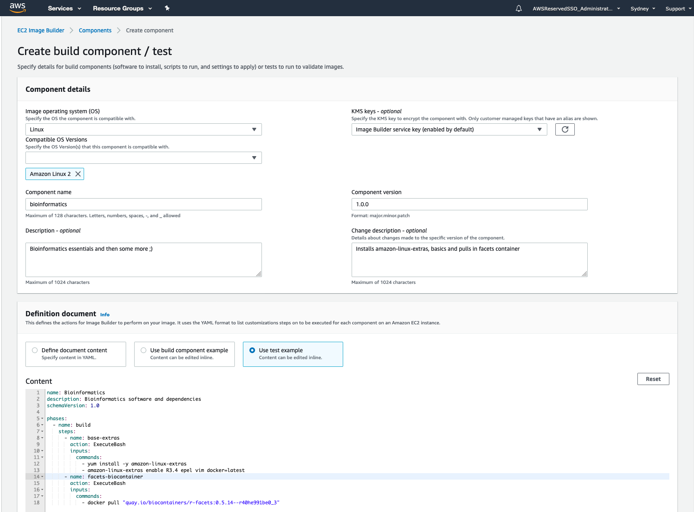
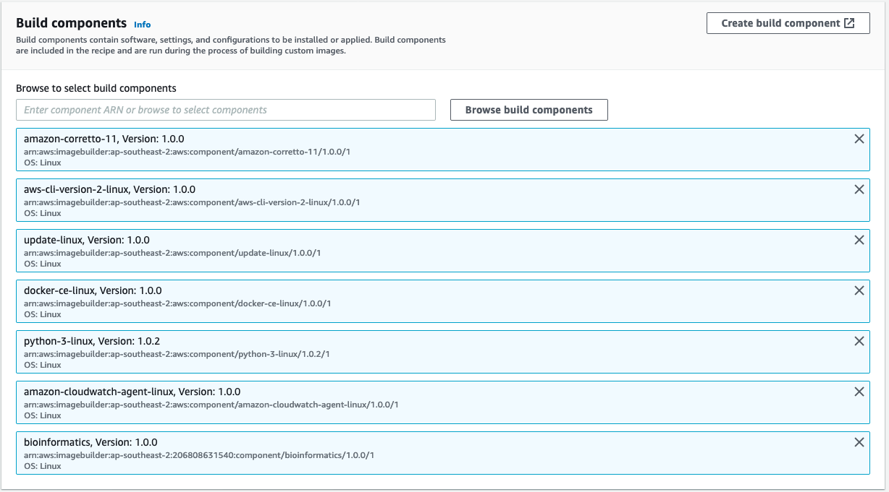

# AWS EC2 Image builder recipes

Boostrap and provision your parallelcluster for interactive Cloud HPC Bioinformatics @UMCCR.

# What is this??

In order to accelerate the bootstrapping process for common software (i.e: R, conda, compilers...) it is recommended to (re)create fresh AMIs. To base off from a fresh Amazon Linux 2 AMI. [The EC2 Image builder eases this process significantly](https://aws.amazon.com/image-builder/):





To use the newly created AMI, just add the following variable to the AWS ParallelCluster config file, under the [cluster ...] section, i.e:

```
custom_ami = ami-0b01adf2b53dcfe7c
```

## Building a new ami with EC2 Builder.

The EC2Builder has two main components.  
1. A source image
2. Recipes and Documents

### Source images
For AWS Parallel cluster, choose your source image from [this ami list](https://github.com/aws/aws-parallelcluster/blob/v2.8.1/amis.txt).    
For the alinux2 base from the ap-southeast-2 region, ami-056a324d5f89ea398 is our desired image.  

We will also refer to this image when testing our recipes and documents before porting them to the image builder.

### Recipes and Documents

Documents command what commands / downloads are run on the source ami to produce our custom AMI.      
Documents are generally in yaml format, examples are [base.yml](base.yml) and [conda.yml](conda.yml).  
A recipe is a suite of (ordered) documents.

### Testing documents locally.

Official docs can be found [here](https://docs.aws.amazon.com/imagebuilder/latest/userguide/image-builder-component-manager-local.html)

1. Head to the EC2 console and spin up an instance (micros are too small for conda installations) 
with the following specs:
    * t2.medium (the t2.micro don't have enough mem for conda installations)
    * The base image as our parallel cluster source image (see above) 
    * The `AmazonSSMManagedInstanceCore` is selected as a iam role for the instance.
      > It is important this role is also set when running the recipe through EC2 Image builder.
        This is so that the S3ReadAccess policy is available for the S3Download actions
                                                                                        
2. You should now be able to log into the instance via `ssm`

3. Install awstoe into the instance with the following commands
    ```bash
    sudo bash -c \
    "yum update -y -q
     yum install -y -q \
        vim \
        wget
      REGION="ap-southeast-2" 
      AWSTOE_URL="https://awstoe-${REGION}.s3.${REGION}.amazonaws.com/latest/linux/amd64/awstoe" 
      wget --output-document /usr/local/bin/awstoe "${AWSTOE_URL}"
      chmod +x /usr/bin/awstoe  
    "
    ```
4. Download your ami documents from s3 or copy and paste them from a local source
    ```bash
    mkdir amis/
    aws s3 sync s3://bucket/path/to/ami_docs/ ami_docs/
    ```

5. Validate your documents
    ```bash
    sudo /usr/local/bin/awstoe validate \
      --documents ami_docs/base.yml,ami_docs/conda.yml,ami_docs/biocontainers.yml
    ```

6. Run your documents on the instance
    ```bash
    sudo /usr/local/bin/awstoe run \
      --documents ami_docs/base.yml,ami_docs/conda.yml,ami_docs/biocontainers.yml
    ```
   
    > Warning: This is run in sudo, this will make changes to the instance. 
    > This will make system changes to the instance. You may have commands in your documents
    > That only work once and so fail a second time you run the document. See the next step on debugging.                                                                                                                                                                                    

7. Debugging your instance.
    If you get a failed error, do not panic. This is the reason you went to all this trouble in the first place!  
    So you could ensure that the documents were correct before you placed them inside EC2Builder.  
    * Run an `ls` and you should see a TOE document.  
    * The `console.log` file will tell you which of your steps has failed.  
    * The `application.log` file will tell you what the error code was, this can be quite verbose 
      so it's worth looking at the `console.log` first.  
    * A note on ordering of documents:  
      Say I ran the example above `... --documents ami_docs/base.yml,ami_docs/conda.yml/ami_docs/biocontainers.yml`
      If I get a failed output, and the console.log tells me it was in my conda.yml document.
      I should edit this document and try it again without the preceding `base.yml`.
      All components in the `base.yml` were run through successfully.

8. Celebrating a successful run:  
    If everything went well, it should conclude with a similar JSON message to the following:
 
    ```json
    {
        "executionId": "52c3deda-d602-11ea-9cff-0a0f79d92462",
        "status": "success",
        "failedStepCount": 0,
        "executedStepCount": 3,
        "failureMessage": "",
        "logUrl": "/home/ec2-user/infrastructure/parallel_cluster/ami/TOE_2020-08-04_03-26-45_UTC-0_52c3deda-d602-11ea-9cff-0a0f79d92462"
    }
    ```

You can now head on to the ec2 image builder to create your recipes and image pipelines knowing well that your documents/recipe succeeds!

# How do I include my software in the cluster's AMI?

For instance, if you needed a (newer?) version of samtools docker container on any docker repository (such as Quay.io or DockerHub):


Then:

 1. Add the docker tag to the `ami/biocontainers.yml` file.
 2. Rebuild the AMI as mentioned above.
 3. Tweak your pcluster config to point to that new AMI (via the `custom_ami` field.